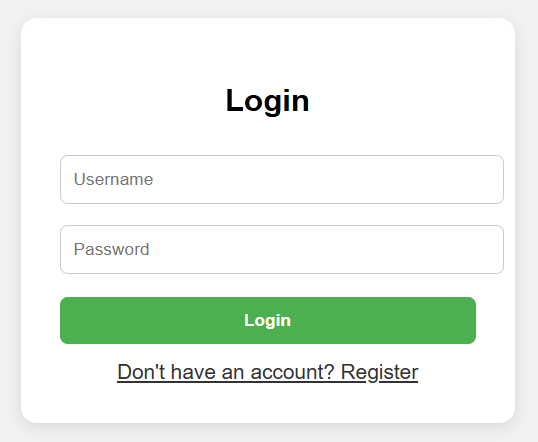
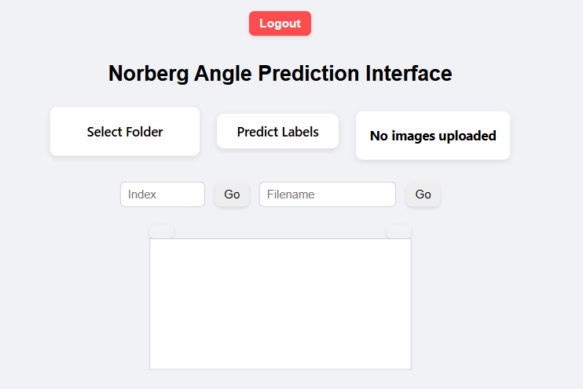
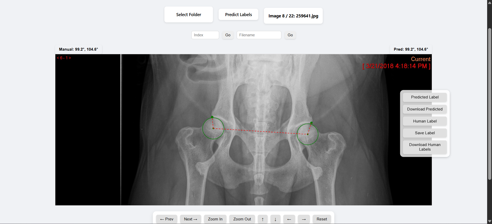
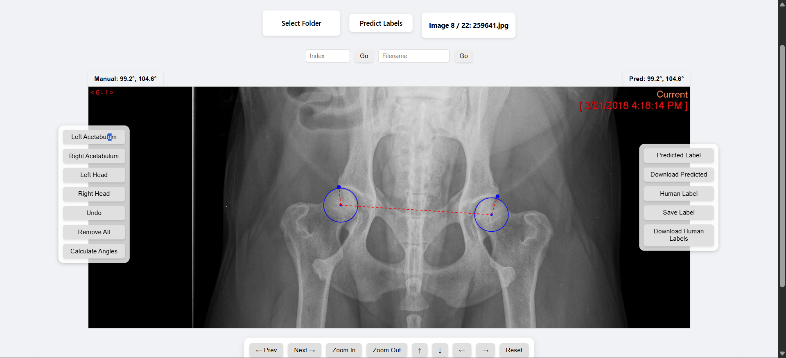

# Dog Hip UI 🐶🦴

A web-based interface for uploading canine hip radiographs, predicting Norberg angle keypoints using deep learning models, and manually adjusting labels with export capability.

## 🔧 Features

- ✅ User login and registration system (with SQLite)
- 📂 Folder-based batch image upload
- 🤖 Automated Norberg angle prediction using custom MMDetection + MMPose model (See details at: https://github.com/ethanYaoyx/ethanYaoyx-Image_Generation_for_Medical_Application_Dog_hip)
- 🎯 Keypoint visualization and angle calculation
- ✍️ Manual keypoint labeling with adjustable radii and undo support
- 💾 Save and download `.mat` files for predictions and manual labels
- 📤 Export results in a zipped folder by user

## 🧠 Tech Stack

- **Backend**: Python, Flask, SQLite
- **Frontend**: HTML, CSS, JavaScript (vanilla)
- **Model**: RTMDet + RTMPose via MMDetection & MMPose
- **Deployment**: Ngrok (development) or production WSGI server


## 📁 Folder Structure

```plaintext
Image_Website/
├── static/
│   ├── uploads/{username}/        # Uploaded images per user
│   ├── Pred/{username}/           # Model predictions
│   └── Human_Labels/{username}/   # Human labeled results
├── templates/
│   ├── index.html                 # Main interface
│   └── login.html                 # Login & registration UI
├── app.py                         # Main Flask backend
├── model.py                       # Model prediction logic
├── init_db.py                     # SQLite user table initializer
└── README.md                      # Project documentation
```


## 🚀 Usage

1. Clone this repo:
    ```bash
    git clone https://github.com/ethanYaoyx/Dog_hip_UI.git
    cd Dog_hip_UI/Image_Website
    ```

## 2. Install Requirements (Ensure You Have Your Model Checkpoints Ready)

📓 Open and run all cells in `env/Setup_env.ipynb`.

✅ Before running, make sure to:

- Download the **RTMPose** model checkpoint to:  
  `mmpose/checkpoint/`  
  The recommended weight file is:  
  `all_m_best_PCK_epoch_5-eac12d89_20240725`  
  📦 [Download link](https://yuad-my.sharepoint.com/:f:/g/personal/yyao3_mail_yu_edu/Eg89uyyGuAlKqJeUJMzXBs8B0QI1I7QXvU2KgTN13oIxrA?e=AVROka)

- Download the **RTMDet** model checkpoint to:  
  `mmdetection/checkpoint/`  
  The recommended weight file is:  
  `rtmdet_m_dog_hip_287-55485ded.pth`  
  📦 [Download link](https://yuad-my.sharepoint.com/:f:/r/personal/yyao3_mail_yu_edu/Documents/weight_mmdetect?csf=1&web=1&e=s5j0B4)

 Please make sure you have same path in model.py.
3. ✅ You can run `env/Test_Prediction.ipynb` to verify that the models are correctly downloaded and the interface is functioning.


4. Initialize the database:
    ```bash
    python init_db.py
    ```

5. Launch the website:
    ```bash
    python app.py
    ```

6. Open in browser:
    ```
    [http://127.0.0.1:5000](https://xxxx-xxx-xxx-xx-xx.ngrok-free.app)
    ```

## 📝 Notes

- Model weights for RTMDet and RTMPose must be placed under the correct paths.
- Ngrok is used for public sharing during development.

## 📷 Example
### 🔐 Login Page


### 🏠 Main Interface


### 🤖 Prediction Mode


### ✍️ Human Labeling Mode



---

© 2025 Ethan Yao – For veterinary radiographic AI use only.
